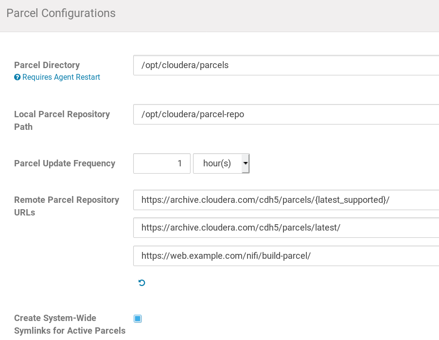

NiFi Parcel
===========

This repository provides a parcel (https://github.com/cloudera/cm_ext) to install Apache NiFi as a service usable by Cloudera Manager.
## Requirements
- CDH >=5.5 (tested with 5.15)
- HDFS
- Zookeeper installed by CDH. The embedded Zookeeper is *not* supported

The CSD provided here creates the following Items:
- a (system) user on *each* node in your Hadoop cluster
  - with `/var/lib/nifi` as home directory
- data and configuration files below `/var/lib/nifi`. 
  - Custom configuration files (SSL, login, etc.) should also be placed there
  - It is posible to change most of those directories use the CDH GUI

## Overview
- Quick install
  - [below one this page](#quick-install)
- Build Parcel and CSD
  - [Build all](/howtos/build-all/)
- Howtos
  - [Setup SSL](/howtos/ssl/)
  - [Enable Ldap (Active Directory)](/howtos/ads-ldap/)
- Todos, finished features
  - [bottom of this page](#todos)

### Quick install
The CSD provided can be installed like any other "Add-on" Service for CDH: [CDH - Add-on Services](https://www.cloudera.com/documentation/enterprise/5-15-x/topics/cm_mc_addon_services.html)

=== On the Node running Cloudera Manager ===
1. Download CSD [latest release](https://github.com/emetriq/nifi-parcel/releases/latest)
```sh
$ cp NIFI-1.2.jar /opt/cloudera/csd
$ sudo service cloudera-scm-server restart
# Wait a min, go to Cloudera Manager -> Add a Service -> NiFi
```
2. Manually add your personal parcel download URL to Cloudera CDH Manager under *Parcels->Configuration*

  - :exclamation: TODO: There is currently no public download for the Nifi parcel available, see [Build all](/howtos/build-all/)
    
3. Download, distribute and activate the parcel (*Cloudera CDH Manager->Parcels*)


## Todos
- [x] "Currently `NiFi` runs under the `root` user" 
  - done. User is *nifi*.
- [x] Expose config options under Cloudera Manager 
  - Conf folder from parcels is used, this needs to be migrated to ConfigWriter - done for all basic settings
- [ ] simplify install
  - [x] Provide precompiled CSD
    - see [latest release](https://github.com/emetriq/nifi-parcel/releases/latest)
  - [ ] Provide parcel repo
  - [ ] Include parcel repo URL in CSD
- [ ] Expose metrics from NiFi in CDH
- [ ] Allow reading log files in CDH
- [x] https config
  - [x] document certificate Management
  - [ ] \(optional\) Puppet CA integration - blocked by https://tickets.puppetlabs.com/browse/SERVER-2338
- [x] Login
  - [x] this requires https
- [ ] Fix *WebUI* link in CDH
- [ ] Parcel building in Jenkins
  - [ ] Use Nifi releases
- [ ] multi distribution support for parcels

## Bugs
- CDH cannot gracefully shutdown  a Nifi node
