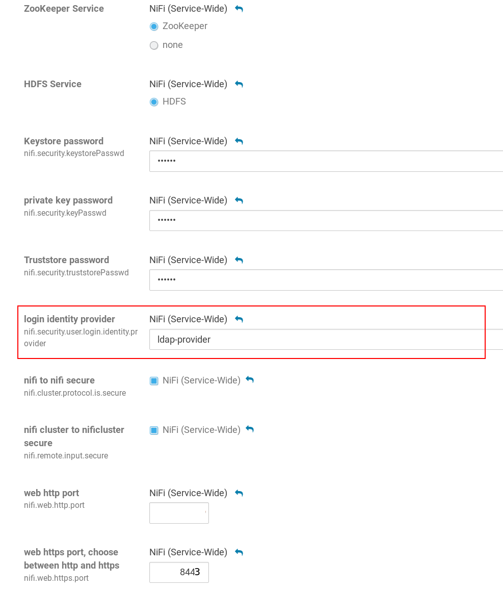

# Enable Login
Nifi differentiates strickly between authentication and authorization. This means you have to enable and configure ldap for *both*.` But you can use the *ldap bind user* and connection settings for both.

## Create authentication config (identity provider)
This is a Microsoft Active Directory compatible setup. 
- `{0}` is a placeholder for the login name
- `&amp;` Some chars need to be escaped in XML for example the ampersand `&`
```xml
    <provider>
        <identifier>ldap-provider</identifier>
        <class>org.apache.nifi.ldap.LdapProvider</class>
        <property name="Authentication Strategy">START_TLS</property>

        <property name="Manager DN">CN=apache nifi,OU=Serviceuser,DC=example,DC=com</property>
        <property name="Manager Password">super_s3cret</property>

        <property name="TLS - Keystore"></property>
        <property name="TLS - Keystore Password"></property>
        <property name="TLS - Keystore Type"></property>
        <property name="TLS - Truststore"></property>
        <property name="TLS - Truststore Password"></property>
        <property name="TLS - Truststore Type"></property>
        <property name="TLS - Client Auth"></property>
        <property name="TLS - Protocol"></property>
        <property name="TLS - Shutdown Gracefully"></property>
        
        <property name="Referral Strategy">FOLLOW</property>
        <property name="Connect Timeout">10 secs</property>
        <property name="Read Timeout">10 secs</property>

        <property name="Url">ldap://ads.example.com:389</property>
        <property name="User Search Base">OU=User,OU=Big-Data,DC=example,DC=com</property>
        <property name="User Search Filter">(&amp;(objectCategory=Person)(sAMAccountName={0}))</property>

        <property name="Identity Strategy">USE_USERNAME</property>
        <property name="Authentication Expiration">12 hours</property>
    </provider>
```

## Create authorization config
This authorization config is similar to the config we already have from our SSL setup. We only need to add a ldap provider for our *group* and *user* list. You can also change the default
```xml
    <userGroupProvider>
        <identifier>ldap-user-group-provider</identifier>
        <class>org.apache.nifi.ldap.tenants.LdapUserGroupProvider</class>
        <property name="Authentication Strategy">START_TLS</property>
    ...
```

### combine node authorization and user (ldap) authorization
The only problem is that with replacing the provider we would lose the node authorization needed for ssl. To avoid this we need to combine the file and ldap providers.
```xml
    <userGroupProvider>
        <identifier>composite-user-group-provider</identifier>
        <class>org.apache.nifi.authorization.CompositeUserGroupProvider</class>
        <property name="User Group Provider 1">ldap-user-group-provider</property>
        <property name="User Group Provider 2">file-user-group-provider</property>
    </userGroupProvider>
...
```

### change "Initial Admin Identity" (optional)
After enabling ldap, we can choose our initial administrator from all users included in our search path. This may be easier than using client certificates.
```xml
    <accessPolicyProvider>
        <identifier>file-access-policy-provider</identifier>
        <class>org.apache.nifi.authorization.FileAccessPolicyProvider</class>
        <property name="User Group Provider">file-user-group-provider</property>
        <property name="Authorizations File">./conf/authorizations.xml</property>
        <property name="Initial Admin Identity">nifi-admin</property>
        <property name="Legacy Authorized Users File"></property>

        <property name="Node Identity 3">CN=node1.example.com, OU=IT, O=example, L=Hamburg, ST=Hamburg, C=DE</property>
        <property name="Node Identity 4">CN=node2.example.com, OU=IT, O=example, L=Hamburg, ST=Hamburg, C=DE</property>
        <property name="Node Identity 5">CN=node3.example.com, OU=IT, O=example, L=Hamburg, ST=Hamburg, C=DE</property>
    </accessPolicyProvider>
```

The complete configuration can be found here:
[authorizers.xml](authorizers.xml with ldap)

# Nifi config
To activate these changes we need to set the authentication provider in *nifi.properties* . Every change can easily be made in the Web-GUI:


