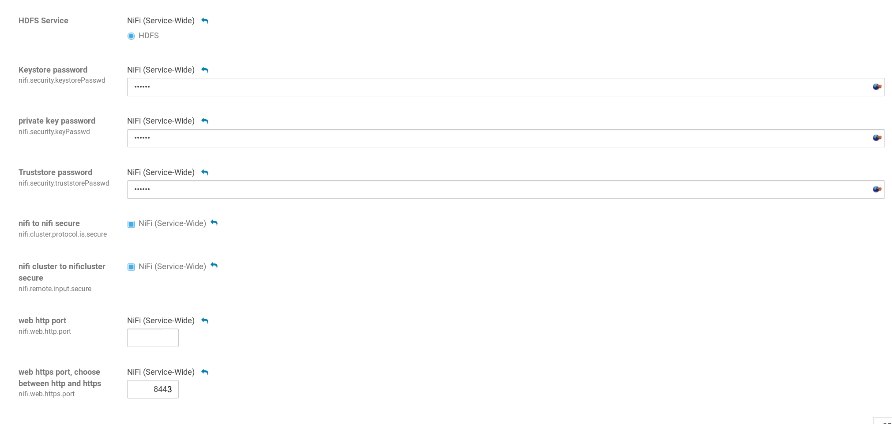

NiFi SSL
===========

SSL and certificates are *required* for enabling authentication and authorization. For optimal security it's recommended to use a local CA and sign every Node.

# Prepare CA
This CA can be created on *any system* that has openssl installed.
## Create CA key and certificate
== on the machine running your CA ==
```bash
mkdir CA
mkdir CA/private
mkdir CA/newcerts
touch CA/index.txt
echo "01" >CA/serial.txt
cd CA
openssl genrsa -aes256 -out private/cakey.pem 4096
openssl req -new -x509 -key private/cakey.pem -out cacert.pem
cp /etc/ssl/openssl.cnf .
```
## Create a openssl.cnf, which allows subject alternative names
NIFI requires that all (nifi) node certificates have SAN(subject alternative name). The SAN needs to be set to the FQDN of the node.
> RFC 2818 describes two methods to match a domain name against a certificate - using the available names within the subjectAlternativeName extension, or, in the absence of a SAN extension, falling back to the commonName. The fallback to the commonName was deprecated in RFC 2818 (published in 2000), but support still remains in a number of TLS clients, often incorrectly.

Her is a diff with the changes you need to make:
[openssl.cnf.diff](openssl.cnf.diff)

```diff
--- /etc/ssl/openssl.cnf        2015-06-11 15:32:37.000000000 +0000
+++ CA/openssl.cnf      2018-10-04 11:38:49.038325516 +0000
@@ -39,7 +39,7 @@
 ####################################################################
 [ CA_default ]
 
-dir            = ./demoCA              # Where everything is kept
+dir            = ./CA          # Where everything is kept
 certs          = $dir/certs            # Where the issued certs are kept
 crl_dir                = $dir/crl              # Where the issued crl are kept
 database       = $dir/index.txt        # database index file.
@@ -122,7 +122,7 @@
 # WARNING: ancient versions of Netscape crash on BMPStrings or UTF8Strings.
 string_mask = utf8only
 
-# req_extensions = v3_req # The extensions to add to a certificate request
+req_extensions = v3_req # The extensions to add to a certificate request
 
 [ req_distinguished_name ]
 countryName                    = Country Name (2 letter code)
@@ -220,6 +220,8 @@
 
 basicConstraints = CA:FALSE
 keyUsage = nonRepudiation, digitalSignature, keyEncipherment
+subjectAltName = ${ENV::SAN}
 
 [ v3_ca ]
```

## Create the truststore
Every Nifi Node needs the public certifacte of our CA. It makes sense to create the truststore only once and copy it to each node.
```bash
cd CA
keytool -import -file cacert.pem -trustcacerts -alias cacert -keystore server_truststore.jks -storetype pkcs12 -storepass changeme -noprompt
scp server_truststore.jks root@node1:/var/lib/nifi/
scp server_truststore.jks root@node2:/var/lib/nifi/
scp server_truststore.jks root@node3:/var/lib/nifi/
```

# Create JKS keystore for each node
Every Nifi node in your cluster needs a keystore and a truststore. The truststore contains all trusted certifiacte authorities, the key store contains your certificates and keys.

## Create the certificate request
== on the each node running Nifi ==
```bash
$JAVA_HOME/bin/keytool -genkeypair -alias $(hostname -f) -keyalg RSA -keystore server_keystore.jks -storetype pkcs12 -keysize 2048 -dname "CN=$(hostname -f),OU=IT,O=example,L=Hamburg,ST=Hamburg,C=DE"
$JAVA_HOME/bin/keytool -certreq -alias $(hostname -f) -keystore server_keystore.jks -storetype pkcs12 -file $(hostname -f).csr -ext san=dns:$(hostname -f)
```
The request can be checked with `openssl req -noout -text -in *.csr` and should look like this:
```csr
Certificate Request:
    Data:
        Version: 0 (0x0)
        Subject: C=DE, ST=Hamburg, L=Hamburg, O=example, OU=IT, CN=node1.example.com
        Subject Public Key Info:
            Public Key Algorithm: rsaEncryption
                Public-Key: (2048 bit)
                Modulus:
                    00:a6:4a:60:70:a8:64:11:65:93:9b:3d:d7:2f:40:
                    92:6d:71:91:53:15:81:ba:c0:e7:e2:97:6f:31:00:
                    a7:03:09:23:31:50:2b:f4:60:26:dc:64:d3:dc:57:
                    d8:80:10:92:7f:fd:60:36:cc:dd:5e:4e:f9:54:59:
                    b8:53:0d:07:19:03:a1:c4:51:f1:53:90:80:47:16:
                    96:f8:ae:6d:9e:7e:3a:b0:ae:16:86:cc:5a:77:64:
                    03:ae:04:33:6a:bd:4c:e0:05:f0:e8:31:b5:4d:4b:
                    98:70:63:c0:8c:49:fb:0d:55:eb:7c:68:4d:de:8a:
                    57:a4:b6:21:7c:68:18:56:2f:18:40:58:65:b5:1b:
                    30:0c:d1:d5:a9:11:9a:7f:0c:d9:91:e9:00:98:a7:
                    16:ee:d0:87:12:40:53:44:ab:ed:67:9d:6c:8a:6f:
                    23:ca:c6:8d:3e:0a:5c:e2:a6:d9:b7:ef:cd:18:cd:
                    af:a0:f4:60:ef:9c:e7:b3:82:ca:de:ff:7f:09:cf:
                    c6:b8:f2:fc:28:e9:87:42:df:3b:70:8a:6c:4c:db:
                    79:15:af:8c:e8:0b:b2:b3:a1:c8:74:e7:1e:6e:9c:
                    5b:f5:1b:de:9e:5c:ae:a1:b4:de:20:12:25:ea:ab:
                    6c:76:49:4f:89:03:79:ac:44:e1:03:4d:1c:8b:a8:
                    75:1d
                Exponent: 65537 (0x10001)
        Attributes:
        Requested Extensions:
            X509v3 Subject Alternative Name: 
                DNS:node1.example.com
            X509v3 Subject Key Identifier: 
                6F:CE:B4:35:3A:AE:4C:86:2E:81:62:89:65:02:B9:15:79:4D:10:EE
    Signature Algorithm: sha256WithRSAEncryption
         7a:a8:42:77:68:6e:4d:65:38:2f:16:4d:15:50:a1:1e:37:fc:
         f8:37:9e:b7:48:84:4d:c7:22:51:36:8a:0d:84:86:3d:17:b3:
         94:cf:28:50:23:00:1d:4c:d5:63:fc:49:3a:19:f0:5c:c6:ea:
         d2:f7:21:b8:7a:fa:d6:42:b8:12:4d:64:bf:91:27:25:be:6c:
         d1:1b:a2:2e:e7:d5:be:05:38:0a:7d:ac:4f:04:b5:f3:7c:20:
         5d:15:fb:06:8d:2e:8b:75:40:17:94:bc:f6:2a:f0:cc:7f:19:
         69:29:6d:cd:a8:a9:39:e0:73:1c:88:8b:9f:6d:28:e3:75:4b:
         11:27:1b:f7:54:f4:3a:28:0e:80:e1:0d:db:0c:35:94:b3:bd:
         b7:84:8c:6a:21:aa:9e:4e:2a:0d:e0:61:2c:e5:31:22:19:93:
         2c:54:6a:6f:0a:64:22:44:3e:52:10:85:ff:18:9a:cd:ab:cc:
         cc:ce:8b:53:af:f9:5e:52:a5:f9:7e:f6:72:43:b8:a9:33:7d:
         bd:2c:46:c1:27:82:8c:30:11:a9:30:87:1d:72:71:c7:50:0e:
         0a:a6:95:98:01:8d:0a:41:bd:53:4b:9d:93:9a:74:b5:04:86:
         b0:4e:c4:7f:82:3b:1b:64:b1:4f:23:56:2d:18:6a:97:73:d4:
         8a:06:10:e6

```

## Sign the request
== on the machine running your CA ==
```bash
scp root@node1:node1.example.com.csr .
scp root@node2:node2.example.com.csr .
scp root@node3:node3.example.com.csr .

SAN="DNS: node1.example.com" openssl ca -policy policy_anything -extensions v3_req -config CA/openssl.cnf -out node1.example.com.crt -infiles node1.example.com.csr
SAN="DNS: node2.example.com" openssl ca -policy policy_anything -extensions v3_req -config CA/openssl.cnf -out node2.example.com.crt -infiles node2.example.com.csr
SAN="DNS: node3.example.com" openssl ca -policy policy_anything -extensions v3_req -config CA/openssl.cnf -out node3.example.com.crt -infiles node3.example.com.csr

scp CA/cacert.pem node1.example.com.crt root@node1:
scp CA/cacert.pem node2.example.com.crt root@node2:
scp CA/cacert.pem node3.example.com.crt root@node3:
```

## Import the certs
== on the each node running Nifi ==
```bash
# The cacert is required to establish a trustancor
keytool -import -file cacert.pem -trustcacerts -alias cacert -keystore server_keystore.jks -storetype pkcs12 -storepass changeme -noprompt
# Certificate was added to keystore
keytool -import -file $(hostname -f).crt -alias $(hostname -f) -keystore server_keystore.jks -storepass changeme -noprompt
# Certificate reply was installed in keystore

# Copy the keystore
cp server_keystore.jks /var/lib/nifi/server_keystore.jks
```

# Authorization of the nifi nodes
We need to create an initial trust between each of the nodes. So we need to add every of our nifi nodes to the authorizers.xml file.

## Example `/var/lib/nifi/authorizers.xml` file
== must be consistent on each node running Nifi ==
You can use this authorizers.xml [authorizers-ssl-only.xml](authorizers.xml ssl only config) provided here, if you only want SSL. 
If you are going to add LDAP/ADS authentication use the one in the [ads ldap Howto](/howtos/ads-ldap/).
```xml
<authorizers>

    <!--
        The FileUserGroupProvider will provide support for managing users and groups which is backed by a file
        on the local file system.

        - Users File - The file where the FileUserGroupProvider will store users and groups.

        - Legacy Authorized Users File - The full path to an existing authorized-users.xml that will be automatically
            be used to load the users and groups into the Users File.

        - Initial User Identity [unique key] - The identity of a users and systems to seed the Users File. The name of
            each property must be unique, for example: "Initial User Identity A", "Initial User Identity B",
            "Initial User Identity C" or "Initial User Identity 1", "Initial User Identity 2", "Initial User Identity 3"

            NOTE: Any identity mapping rules specified in nifi.properties will also be applied to the user identities,
            so the values should be the unmapped identities (i.e. full DN from a certificate).
    -->
    <userGroupProvider>
        <identifier>file-user-group-provider</identifier>
        <class>org.apache.nifi.authorization.FileUserGroupProvider</class>
        <property name="Users File">./conf/users.xml</property>
        <property name="Legacy Authorized Users File"></property>

        <property name="Initial User Identity 1">EMAILADDRESS=admins@example.com, CN=admin@example.com, OU=IT, O=example, L=Hamburg, ST=Hamburg, C=DE</property>
        <property name="Initial User Identity 3">CN=node1.example.com, OU=IT, O=example, L=Hamburg, ST=Hamburg, C=DE</property>
        <property name="Initial User Identity 4">CN=node2.example.com, OU=IT, O=example, L=Hamburg, ST=Hamburg, C=DE</property>
        <property name="Initial User Identity 5">CN=node3.example.com, OU=IT, O=example, L=Hamburg, ST=Hamburg, C=DE</property>
    </userGroupProvider>
    <accessPolicyProvider>
        <identifier>file-access-policy-provider</identifier>
        <class>org.apache.nifi.authorization.FileAccessPolicyProvider</class>
        <property name="User Group Provider">file-user-group-provider</property>
        <property name="Authorizations File">./conf/authorizations.xml</property>
        <property name="Initial Admin Identity">EMAILADDRESS=admins@example.com, CN=admin@example.com, OU=IT, O=example, L=Hamburg, ST=Hamburg, C=DE</property>
        <property name="Legacy Authorized Users File"></property>

        <property name="Node Identity 3">CN=node1.example.com, OU=IT, O=example, L=Hamburg, ST=Hamburg, C=DE</property>
        <property name="Node Identity 4">CN=node2.example.com, OU=IT, O=example, L=Hamburg, ST=Hamburg, C=DE</property>
        <property name="Node Identity 5">CN=node3.example.com, OU=IT, O=example, L=Hamburg, ST=Hamburg, C=DE</property>
    </accessPolicyProvider>
    ...
```

## (optional) Create admin cert
If you are *not enabling* ldap, kerberos or similar you need a usercertificate to login. If skip this, there is now way for you to login.
```bash
openssl genrsa -out admin.key 2048
openssl req -new -out admin.csr -key admin.key
SAN=admin@example.com openssl ca -policy policy_anything -config CA/openssl.cnf -out admin3.crt -infiles admin3.csr
```

# Nifi config
To activate these changes we need to aktivate it in *nifi.properties* . Every change can easily be made in the Web-GUI:

